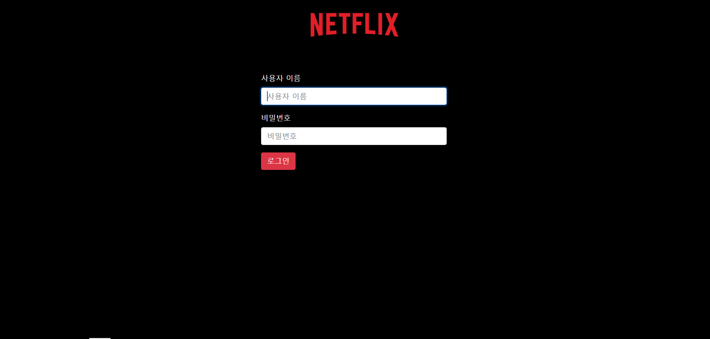
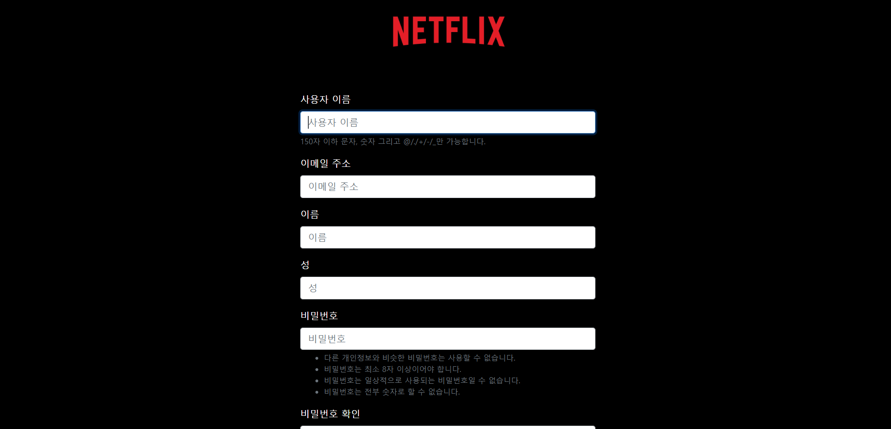
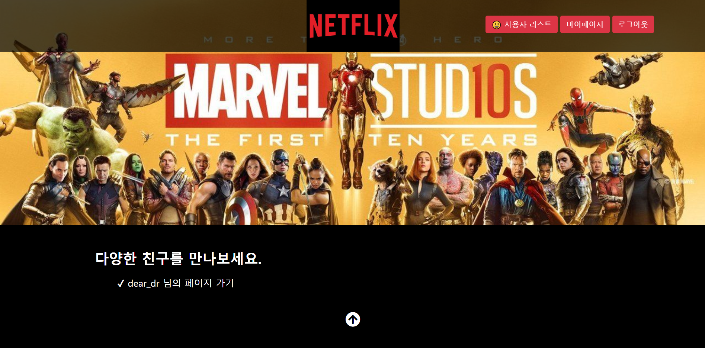
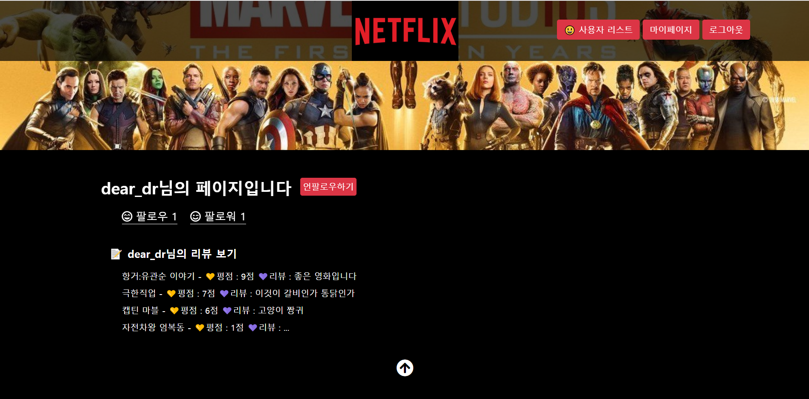
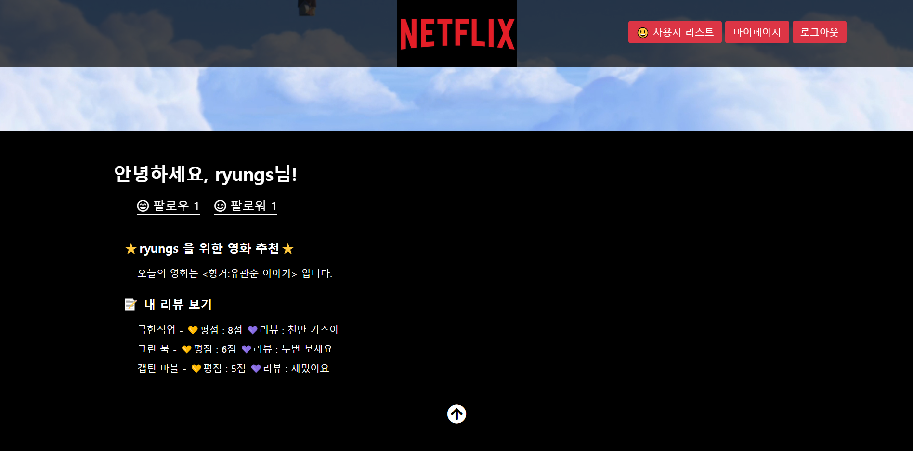
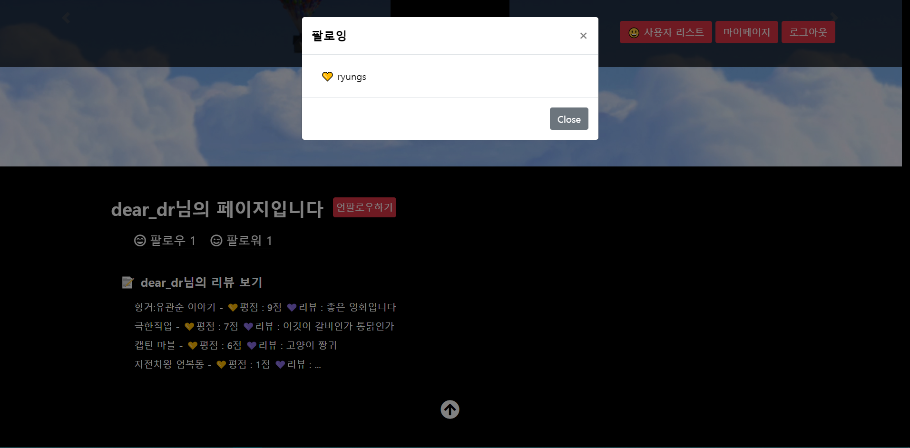
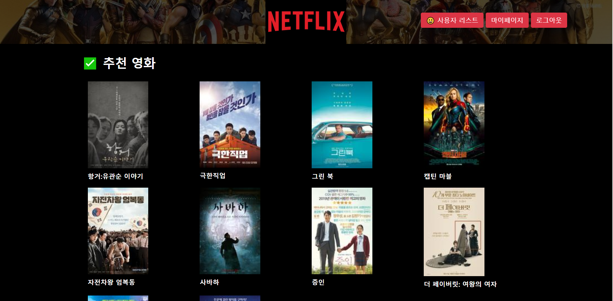
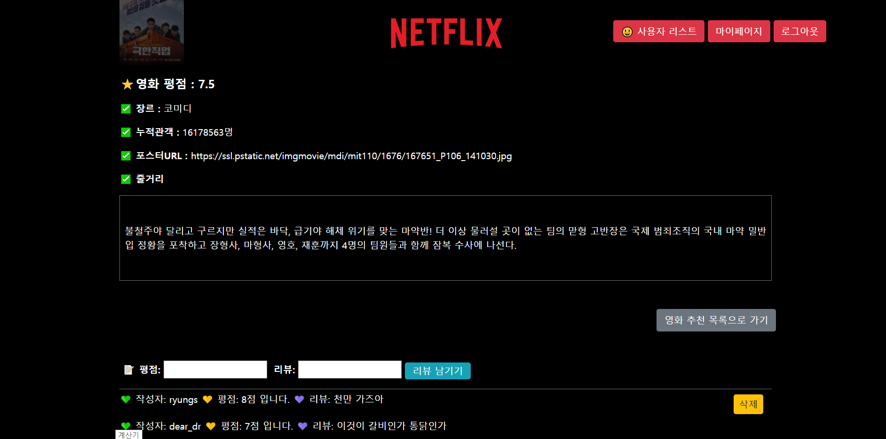

# Read me (완료)

## 1. 프로젝트 설명

- 이 프로젝트는 넷플릭스는 모티브로 영화 스트리밍 사이트를 구현했습니다
- 가입한 유저들 간의 평점과 리뷰를 공유할 수 있으며, 팔로워를 기반으로 평점이 높은 영화를 추천받을 수 있습니다.

## 2. 준비 사항

1. Python Web Framework 
    - Django 2.1.7
    - Python 3.6.7
2. 샘플 영화 정보
    - [링크](https://zzu.li/09_m2m)

## 3. 모델 및 데이터베이스

1. **데이터베이스 설계**

    - `db.sqlite3` 에서 테이블 간의 관계는 아래와 같습니다.
    * `User`

    | 필드명 | 자료형 | 설명|
    | ---------- | ------ | ---- |
    | username   | String | 필수 |
    | password   | String | 필수 |
    | email      | String | 선택 |
    | first_name | String | 선택 |
    | last_name  | String | 선택 |

    * `Movie`
    | 필드명 | 자료형 | 설명|
    | ----------- | -------- | -------------------------- |
    | id          | Integer | Primary Key                |
    | title       | String   | 영화명                     |
    | audience    | Integer  | 누적 관객수                |
    | poster_url  | String   | 포스터 이미지 URL          |
    | description | Text     | 영화 소개                  |
    | genre_id    | Integer  | Genre의 Primary Key(id 값) |

    * `Genre`
    | 필드명 | 자료형 | 설명|
    | ----------- | -------- | -------------------------- |
    | id          | Interger | Primary Key                |
    | name       | String   | 장르 구분                     |

    * `Score`
    | 필드명 | 자료형 | 설명|
    | ----------- | -------- | -------------------------- |
    | id          | Interger | Primary Key                |
    | content | String | 한줄평(평가 내용) |
    | value | Integer | 평점 |
    | movie_id | Integer | Movie의 Primary Key(id 값) |
    | user_id | Integer | User의 Primary Key(id 값) |

    * `accounts_user_followers`
    | 필드명 | 자료형 | 설명|
    | ----------- | -------- | -------------------------- |
    | id          | Interger | Primary Key                |
    | from_user_id | Integer | User의 Primary Key(id 값) |
    | to_user_id | Integer | User의 Primary Key(id 값) |

2. **Seed Data 반영**

    1. 주어진 `movie.json` 과 `genre.json` 을 `movies/fixtures/` 디렉토리로 옮깁니다.

    2. 아래의 명령어를 통해 반영합니다.

            $ python manage.py loaddata genre.json
            Installed 11 object(s) from 1 fixture(s)
            $ python manage.py loaddata movie.json
            Installed 10 object(s) from 1 fixture(s)

    3. admin.py 에 `Genre` 와 `Movie` 클래스를 등록한 후,  `/admin` 을 통해 실제로 데이터베이스에 반영되었는지 확인해봅시다.

    

## 4. 앱 및 페이지 설명

#### 1) **`accounts` App**

- 유저 회원가입, 로그인, 로그아웃, 유저 리스트, 각 유저별 상세페이지를 구현 

1. ##### 유저 목록

    - 본인을 제외한 사용자의 목록이 나타나며, 사용자의 `username` 을 클릭하면 `유저 상세보기` 페이지로 이동

    

    

2. ##### 유저  상세보기 (`accounts/{user_username}/` )

    - 로그인한 사람만이 사용자의 상세 내용 페이지에서 해당 유저를 follow하거나 unfollow를 할 수 있습니다.
    - 해당 유저가 작성한 평점 정보가 모두 출력됩니다.
    - 해당 유저를 팔로우 한 사람의 수, 팔로잉 한 사람의 수가 출력됩니다.
    - 팔로워 중 평점이 높은 영화를 기준으로 영화 추천을 합니다.
    - 본인이 아닌 상대방의 상세페이지에서는 영화 추천이 보이지 않습니다.
    - 유저 남긴 리뷰를 모두 볼 수 있습니다

    ##### < 다른 유저 상세페이지>

    

    

    ##### <로그인한 유저 상세페이지>

    

    

3. 팔로우, 팔로워  (`follow/{user_username}/` )

   - 팔로우, 팔로잉 사람 수를 클릭하면 팔로워 목록을 modal 로 구현
   - 팔로워, 팔로잉 아이디를 클릭하면 해당 유저의 상세 페이지로 이동

   

 

#### 2) **`movies` App**

1. ##### 영화 목록(`movies/` )

   - 영화의 이미지를 클릭하면 `영화 상세보기` 페이지로 이동
   - 로고를 클릭하면 `영화목록`페이지로 돌아옴
   - 사용자 리스트를 클릭하면 `가입된 유저들의 리스트` 페이지로 이동
   - 마이페이지를 클릭하면 `내 계정` 페이지로 이동

   

2. ##### 영화 상세보기(`movies/{movie_pk}/` )

   - 영화 관련 정보가 모두 나열
   - 로그인 한 사람만 영화 평점을 남길 수 있습니다
   - 모든 사람은 평점 목록을 볼 수 있습니다.
   - 자신이 남긴 평점과 리뷰만 삭제 가능합니다.
   - 해당 영화 평점은 리뷰남긴 유저들의 평균으로 계산됩니다.

